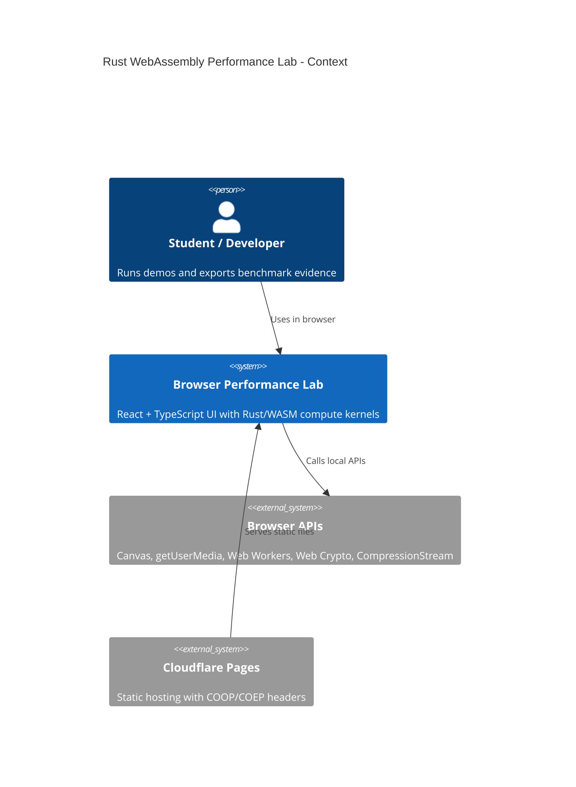
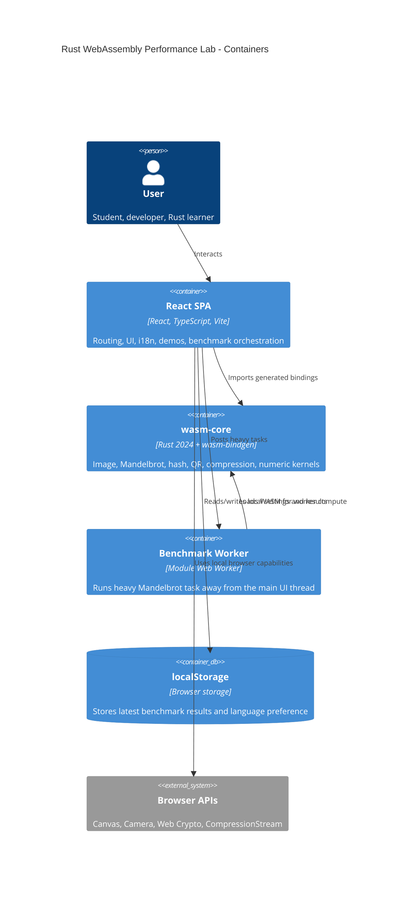
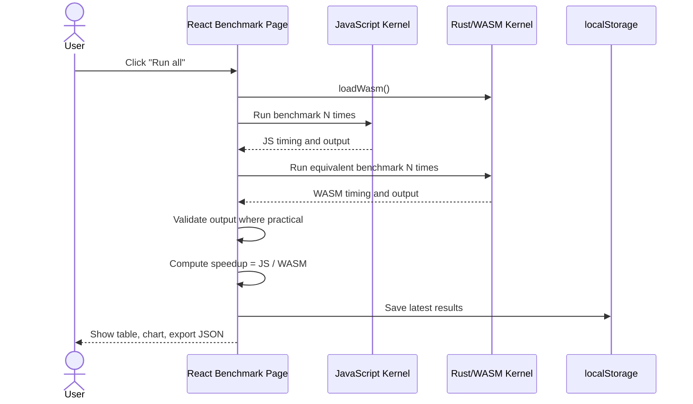
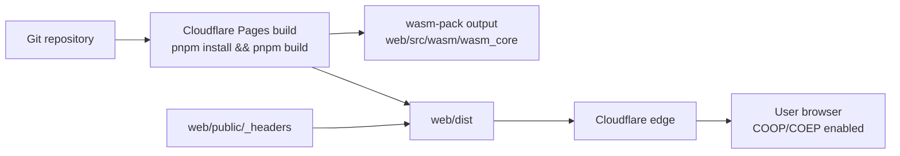

# Architecture

This application is a static, browser-only system. There is no backend server and no REST API. Rust code is compiled into a WebAssembly package and imported by the React frontend.

## C4 Context

## Container Diagram

## Benchmark Sequence

## Deployment Diagram

## Frontend

The frontend is a Vite React SPA. Routes are lazy-loaded for code splitting:

- `/`
- `/dashboard`
- `/demos/image`
- `/demos/camera`
- `/demos/mandelbrot`
- `/demos/hash`
- `/demos/qr`
- `/demos/compression`
- `/benchmarks`
- `/about`
- `/docs`
- `/not-found`

Reusable components include layout, navbar, cards, alerts, buttons, tabs, tables, charts, file upload, canvas wrappers, stat cards, and language switching.

## WASM Module

`crates/wasm-core` exposes stable `wasm-bindgen` functions. The React app imports generated bindings through `web/src/wasm/wasmLoader.ts`, which centralizes initialization and error handling.

## Workers

`web/src/workers/benchWorker.ts` runs Mandelbrot rendering in a module Web Worker. This satisfies the non-blocking heavy computation requirement and demonstrates the path toward true threaded WASM.

## Browser APIs

- Canvas: image previews, filtered output, fractal, QR drawing
- getUserMedia: real-time camera demo
- Web Crypto: JS PBKDF2 comparison and salt generation
- CompressionStream: JS compression comparison where supported
- localStorage: language and latest benchmark results

## Security Notes

The app has no backend and does not upload user content. Camera frames, passwords, and files stay in browser memory. Input sizes are limited to reduce browser freeze risk. The app avoids `dangerouslySetInnerHTML`.

